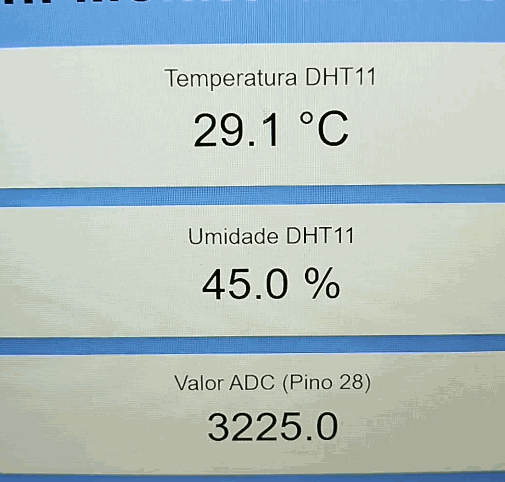

# ✨ Trabalho 04 - Parte 02 - Sistema de Monitoramento Ambiente com Raspberry Pi Pico W

 Repositório dedicado ao sistema de monitoramento ambiental utilizando a placa Raspberry Pi Pico W, que coleta dados de temperatura, umidade e luminosidade, exibindo-os em um display OLED e disponibilizando-os via servidor web. Essa é a parte 02, com melhorias no webserver e conexão TCP 

## :clipboard: Apresentação da tarefa

Para este trabalho foi necessário implementar um sistema de monitoramento ambiental utilizando o Raspberry Pi Pico W. O sistema coleta dados de temperatura e umidade através do sensor DHT11, além de monitorar a luminosidade ambiente via um LDR conectado a uma entrada analógica. Os dados são exibidos em um display OLED SSD1306 e disponibilizados remotamente através de um servidor web integrado que roda na própria placa. O servidor funciona com uma página HTML e conexão TCP que nessa segunda parte fora melhorado.

## :dart: Objetivos

- Implementar um sistema de monitoramento de temperatura, umidade e luminosidade
- Exibir dados em tempo real no display OLED SSD1306
- Disponibilizar os dados via servidor web através da conexão Wi-Fi
- Acionar um buzzer quando a temperatura ultrapassar um limite pré-definido
- Controlar um LED quando a luminosidade ultrapassar um limite pré-definido
- Permitir ativação/desativação dos alertas através de botões físicos e pela página do webserver
- Utilizar os conhecimentos de IoT e LwIP

## :books: Descrição do Projeto

Utilizou-se a placa Raspberry Pi Pico W (que possui o microcontrolador RP2040) para criar um sistema completo de monitoramento ambiental. O sistema faz leituras de um sensor DHT11 para obter temperatura e umidade, e de um LDR para medir luminosidade. Os dados são mostrados localmente em um display OLED SSD1306 e também podem ser acessados remotamente através de um servidor web que utiliza o chip Wi-Fi integrado (CYW43) da Pico W. O sistema também implementa alertas configuráveis: quando a temperatura ultrapassa um limite pré-definido de 31°C, um buzzer é acionado; quando a luminosidade ultrapassa o valor de 3500, um LED é ativado. Dois botões físicos (nos pinos 5 e 6) permitem habilitar/desabilitar esses alertas, e a mesma funcionalidade está disponível através da interface web.

## :walking: Integrantes do Projeto

Matheus Pereira Alves

## :bookmark_tabs: Funcionamento do Projeto

O firmware inicializa os periféricos (I2C, PWM, ADC, GPIO) e estabelece conexão Wi-Fi com as credenciais configuradas. Um servidor TCP é configurado para responder requisições HTTP na porta 80. Em ciclos contínuos, o sistema:

- Coleta dados do sensor DHT11 (temperatura e umidade)
- Lê o valor do LDR através do ADC no pino 28
- Atualiza o display OLED com essas informações
- Verifica se a temperatura ultrapassa o limite de 31°C configurado
- Aciona o buzzer se a temperatura estiver alta (quando habilitado)
- Verifica se a luminosidade ultrapassa o limite de 3500 configurado
- Aciona o LED se a luminosidade estiver alta (quando habilitado)
- Responde às requisições HTTP com uma página web contendo os dados e controles
- Os botões funcionam com debounce por software (250ms) e alternam o estado dos alertas

A interface web apresenta os valores atuais dos sensores e permite ativar/desativar o buzzer e o LED remotamente. A página se atualiza automaticamente a cada 5 segundos para mostrar os dados mais recentes.

## :eyes: Observações

- Foi utilizada a biblioteca lwIP para implementação do servidor web
- O display SSD1306 é controlado via I2C (pinos SDA: 14, SCL: 15)
- O buzzer é controlado via PWM para permitir ajuste de volume
- O projeto implementa debounce para evitar múltiplas detecções em um único pressionamento de botão
- O projeto funciona como um sistema bare-metal (sem sistema operacional)
- É utilizada uma biblioteca externa para o DHT11
- É recomendável a utilização do pico SDK 1.5.1
- O projeto utiliza o formato HTML para criar uma interface web responsiva
- Para utilizar o projeto, é necessário configurar o SSID e senha da rede Wi-Fi nos defines correspondentes
- Se atentar no protocolo de segurança do seu roteador WiFi, pos isso causa algumas mudanças no código

## :camera: GIF mostrando o funcionamento do programa na placa Raspberry Pi Pico W

  

## :arrow_forward: Vídeo no youtube mostrando o funcionamento do programa na placa Raspberry Pi Pico W

    <a href="https://www.youtube.com/watch?v=JYvfb7n6uu0">Clique aqui para acessar o vídeo</a>

